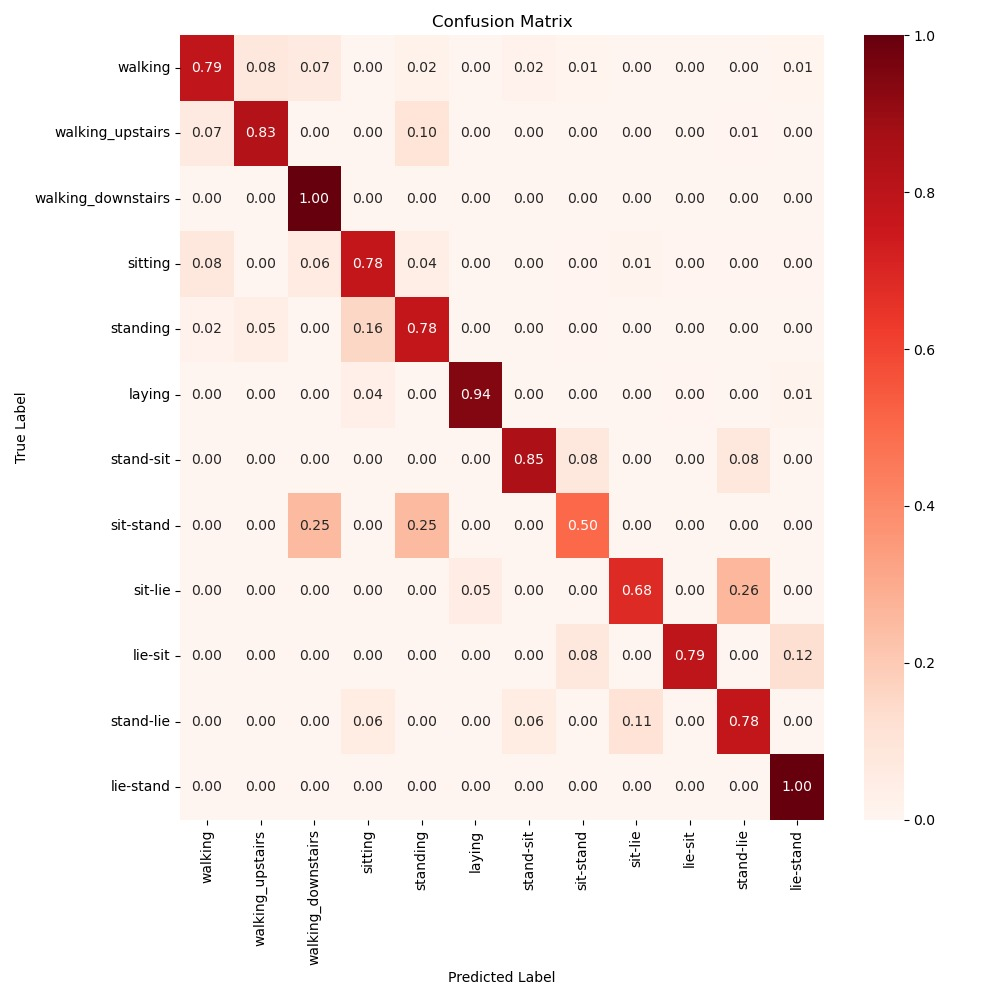

# DL-Lab Project : Diabetic Retinopathy detection

# Team04
- Name: Mohammed Jaseel Kunnathodika (st191717)
- Name: Yueyang Jiang (st186731)

# How to run the code
1. Run the resize.py by running the sbatch.sh. You can find the resized images in the path of "dl-lab-24w-team04/DL_LAB_Diabetic_Retinopathy_Detection/revized_images/train" and "dl-lab-24w-team04/DL_LAB_Diabetic_Retinopathy_Detection/revized_images/test".
2. Run the dataclass.py by running the sbatch.sh. You can find the output images in the path of 'dl-lab-24w-team04/DL_LAB_Diabetic_Retinopathy_Detection/revized_images/test/binary'.
3. Run the data_balance.py by running the sbatch.sh. You can find the output images in the path of 'dl-lab-24w-team04/DL_LAB_Diabetic_Retinopathy_Detection/augmented_images/train'.
4. Run the main.py file with FLAGS.train = True by running the sbatch.sh. You can get the training accuracy, validation accuracy and checkpoints for three models(mobilenet_like, vgg_like and inception_v2_like). After that, you can click the link of wandb to check the charts.
5. Run the main.py file with FLAGS.train = False by running the sbatch.sh. You can get the evaluation accuracy, sensitivity, specificity, precision, f1_score and confusion_matrix.
6. Run the main.py file with FLAGS.train = False and update ensemble = True in main.py for ensembled results by running the sbatch.sh. You can get the evaluation accuracy, sensitivity, specificity, precision, f1_score and confusion_matrix for ensembled results.
7. Run the wandb_sweep.py by running the sbatch.sh (Please add # to train_model.unfrz_layer and grad_cam_visualization.img_path, before running this file or it will raise errors). You can get the training accuracy, validation accuracy and checkpoints for three models(mobilenet_like, vgg_like and inception_v2_like). After that, you can click the link of wandb in the result to get the hyperparameters you need and check the charts.
8. Run the GRAD_CAM_visualization.py by running the sbatch.sh. You can get the visualization result in the path of'dl-lab-24w-team04/DL_LAB_Diabetic_Retinopathy_Detection/output_grad_cam/grad_cam.png'

# Results

Mobilenet, VGGNet, and InceptionV2 are trained through transfer learning and achieved high accuracy.  See **Table 1**.

### Table 1: Information of models from transfer learning

| Model name   | Non-trainable parameters | Trainable parameters | Validation accuracy |
|-------------|-------------------------|----------------------|---------------------|
| Mobilenet   | 3,231,248               | 79,413               | 0.8547              |
| VGGNet      | 14,714,688              | 67,425               | 0.8803              |
| InceptionV2 | 54,339,312              | 1,679,289            | 0.8974              |

The evaluation results for each model are provided in **Table 2**.  
The ensemble evaluation results are shown in **Table 3**.

### Table 2: Evaluation results for three models

| Model Name  | Test Accuracy |
|------------|--------------|
| VGGNet     | 0.8350       |
| MobileNet  | 0.7864       |
| InceptionV2| 0.8350       |

### Table3: Evaluation result for ensemble learning

| Accuracy | Sensitivity (Recall) | Specificity | Precision | F1-Score | Confusion Matrix |
|----------|----------------------|-------------|-----------|-----------|-----------------|
| 0.8447   | 0.7969               | 0.9231      | 0.9444    | 0.8644    | TP=51, FP=3, TN=36, FN=13 |

The result of deep visualization is demonstrated in Figure 1.

    

                                                Figure 1: Grad-CAM visualization of the model

# DL-Lab Project : Human Activity Recognition

# How to run the code
1. Run the main.py with FLAGS.train = True for gru_like by running the sbatch.sh. You can get the training accuracy, validation accuracy and checkpoints for 2 models (gru_like and lstm_like). After that, you can click the link of wandb to check the charts.
2. Run the main.py with FLAGS.train = True for lstm_like by running the sbatch.sh(please add # to train_selected_model(model_type='gru', ds_train=ds_train, ds_val=ds_val, batch_size=batch_size, run_paths=run_paths_2) and cancel the # of train_selected_model(model_type='lstm', ds_train=ds_train, ds_val=ds_val, batch_size=batch_size, run_paths=run_paths_1) in main.py and add # to the codes of # Training for gru_like and cancel the # to the codes of # Training for lstm_like in config.gin). 
3. Run the main.py with  FLAGS.train = False for gru_like by running the sbatch.sh. You can get the confusion_matrix and evaluation accuracy of both models.
4. Run the main.py with FLAGS.train = False for lstm_like by running the sbatch.sh (please add # to restore_checkpoint(model=model_2, checkpoint_path=/home/RUS_CIP/st186731/DL_LAB_HAPT/HAR/experiments/lstm_like/ckpts) and cancel # to restore_checkpoint(model=model_1, checkpoint_path=/home/RUS_CIP/st186731/DL_LAB_HAPT/HAR/experiments/gru_like/ckpts) in main.py)
5. Run the visualization.py by running the sbatch.sh
6. Run the wandb_sweep.py by running the sbatch.sh(Please add # to all codes of # Metrics in config.gin). You can get the training accuracy, validation accuracy and checkpoints for 2 models(gru_like and lstm_like). After that, you can click the link of wandb in the result to get the hyperparameters you need and check the charts.

# Results

After training, we can get the results for both models: GRU and LSTM. See table 4
# Table 4: LSTM and GRU Model Performance

| Model | Trainable Parameters | Validation Accuracy |    Test Accuracy    |
|-------|----------------------|---------------------|---------------------|
| LSTM  | 84,578               | 69.94%              |        82.35%       |
| GRU   | 86,424               | 80.48%              |        83,5%        |

The result of confusion matrix for GRU is demonstrated in Figure 2.

    

                                                Figure 2: confusion matrix for GRU

The result of confusion matrix for LSTM is shown in Figure 3.

    

                                                Figure 3: confusion matrix for LSTM
